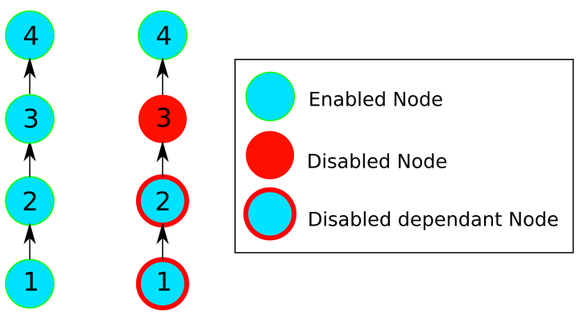
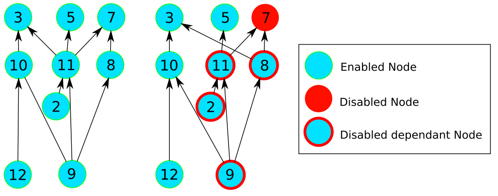

# A tolerant toposort

Extends toposort to support disabled nodes, returning batches of node independent of disabled nodes


The use case was
- To process all nodes, iterating through teh batches supplied by toposort
- Whilst processing, nodes might be found to be disabled
- Nodes could not be processed if dependee(?) nodes were disabled
- Fixing,aka Enabling nodes, took time
- Processing took time
- Once a node was processed, it needed no further processing

(think building packages... )

Requirements
- have the best handle on the number of disabled nodes (process as much as possible)
- Concurrently:
  -   process nodes
  -   Fix nodes


Using default toposort, as a node was found disabled, it required enabling (fixing) before any more nodes could be iterated

, and potentially more disabled nodes discovered

With tolerant toposort
- Processing of all independant ( of disabled ) nodes can be attempted
- As disabled nodes are encountered they can be added to teh set, and a revised batch set created
- Processing can then continue until all possible nodes have been attempted
- The maximum set of disabled nodes is returned

```
disabled=set()
processed=set()# persist this!!
while(true):
	batches = toposort(get_graph(),disabled)
    processedAny= false
    break if ! batches
    try:
        for batch in batches:
            for node in batch:
                next if processed(node)
                if build(node):
                    processed.add(node)
                    processedAny= true
                else:
                    raise ProcessException(node)
        break if !processedAny
    except ProcessException as be:
    	disabled.add(be.node)
    
```

Allows a set disabled nodes to be passed to toposort

The disabled nodes, and any dependents, will not be returned





# Testing
```
 nosetests
 python3 setup.py test
 ```